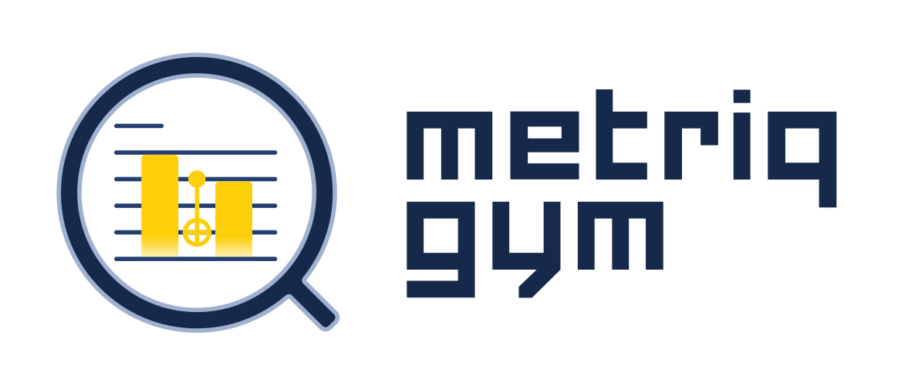

<div align="center">
  
</div>

# metriq-gym

[](https://unitary.foundation)
[](https://pypi.org/project/metriq-gym/)
[](https://pepy.tech/project/metriq-gym)
[](https://metriq-gym.readthedocs.io/en/latest/)
[](http://discord.unitary.foundation)
[](CODE_OF_CONDUCT.md)


metriq-gym is a Python framework for implementing and running standard quantum benchmarks on different quantum devices by different providers.

- _Open_ – Open-source since its inception and fully developed in public.
- _Transparent_ – All benchmark parameters are defined in a schema file and the benchmark code is reviewable by the community.
- _Cross-platform_ – Supports running benchmarks on multiple quantum hardware providers (_integration powered by [qBraid-SDK](https://github.com/qBraid/qBraid)_)
- _User-friendly_ – Provides a simple command-line interface for dispatching, monitoring, and polling benchmark jobs (you can go on with your life while your job waits in the queue).

## Quick Start

Four easy steps to get started with `metriq-gym`!

1. Install `metriq-gym` directly in your Python environment using pip:

   ```sh
   pip install metriq-gym
   ```

2. Download a benchmark configuration file from the `schemas/examples/` directory

    ```sh
    curl -O https://raw.githubusercontent.com/unitaryfoundation/metriq-gym/refs/heads/main/metriq_gym/schemas/examples/wormhole.example.json
    ```

3. Dispatch it to a quantum device or simulator.

    ```sh
    mgym job dispatch wormhole.example.json -p local -d aer_simulator
    ```
4. Poll the job to get the results.

    ```sh
    mgym job poll latest
    ```

You will see the results of the benchmark printed in your terminal. E.g.
```sh
{'device': 'aer_simulator',
 'job_type': 'Wormhole',
 'provider': 'local',
 'results': {'expectation_value': 0.99658203125},
 'timestamp': '2025-07-29T20:31:17.978851',
 'version': '0.1.3.dev0'}
```

Explore more examples in the ready-made JSON schemas under ``metriq_gym/schemas/examples/``.

## Documentation

- CLI workflows, credential setup, and upload instructions: [Command-Line Workflows](https://metriq-gym.readthedocs.io/en/latest/cli_workflows.html)
- Contributor and release guidance: [Developer Guide](https://metriq-gym.readthedocs.io/en/latest/developer_guide.html)
- API reference and benchmark integration notes: [metriq-gym Docs](https://metriq-gym.readthedocs.io/)

## Community

- Join the discussion on [Discord](http://discord.unitary.foundation) (`#metriq` channel)
- Ask questions or share ideas via [GitHub Discussions](https://github.com/unitaryfoundation/metriq-gym/discussions)

## Contributing

Follow the [Developer Guide](https://metriq-gym.readthedocs.io/en/latest/developer_guide.html). Issues and pull requests are welcome!

## License

metriq-gym is available under the [GNU GPL v3.0 or later](LICENSE).
